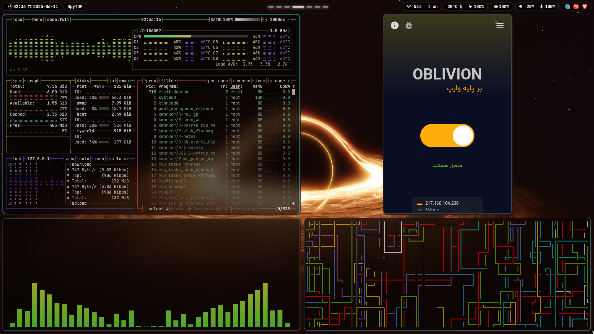
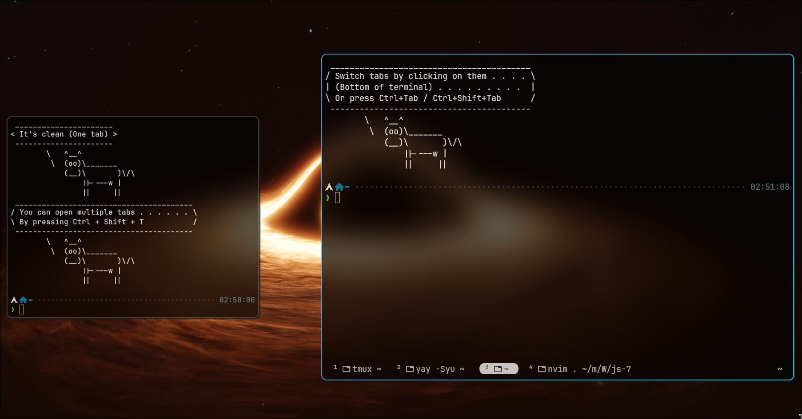

# ✨ My Dotfiles

> A collection of my personal dotfiles for a highly customized and efficient development environment.


This repository contains configuration files for various tools and applications. The main focus is on creating a seamless and productive user experience with a focus on aesthetics and usability

- [My old dotfiles are here](./my-old-dot-files/README.md)(i3 manjaro x11 rofi i3block) 

## 📌 Table of Contents

*   [🖼️ Screenshots](#screenshots)
*   [🧩 Components](#components)
*   [💎 Hyprland](#hyprland)
*   [📊 Waybar](#waybar)
*   [🐱 Kitty](#kitty)
*   [🐠 Fish](#fish)
*   [💤 Nvim](#nvim)
*   [⬇️ Prerequisites](#prerequisites)
*   [💾 Installation](#installation)
*   [⌨️ Keybindings](#keybindings)
*   [🙏 Credits](#credits)

## 🖼️ Screenshots

Add your own screenshots here to showcase your setup!

*   **Desktop:**

    
*   **Application View:**

    > WIP

    > ``


*   **Customized Terminal:**

    

## 🧩 Components

Here's a breakdown of the key components in this dotfiles setup:

*   **Hyprland:** A dynamic tiling Wayland compositor that doesn't sacrifice on its looks.
*   **Waybar:** A highly customizable Wayland bar.
*   **Kitty:** A fast, feature-rich terminal emulator.
*   **Fish Shell:** A smart and user-friendly command-line shell.
*   **Nvim:** Highly extensible Vim-based text editor

## 💎 Hyprland

Hyprland is the heart of this setup, providing a smooth and visually appealing desktop environment. Configuration is split into several files under `@hypr/UserConfigs/` for better organization.
Some noteworthy configuration files are:

*   `@hypr/hyprland.conf`: main Hyprland configuration file.
*   `@hypr/UserConfigs/Keybinds.conf`: Keybindings for Hyprland
*   `@hypr/UserConfigs/Animations.conf`: Animations used in hyprland.
*   `@hypr/UserConfigs/Monitors.conf`: Configures monitors.

Here are some of the most used keybinds you can find in `@hypr/UserConfigs/Keybinds.conf`:

```sh
#Move window with arrow keys
bind = $mainMod SHIFT, left, movewindow, l
bind = $mainMod SHIFT, right, movewindow, r
bind = $mainMod SHIFT, up, movewindow, u
bind = $mainMod SHIFT, down, movewindow, d

#Switch between windows with arrow keys
bind = $mainMod, left, movefocus, l
bind = $mainMod, right, movefocus, r
bind = $mainMod, up, movefocus, u
bind = $mainMod, down, movefocus, d

#Switch to specific workspace
bind = $mainMod, 1, workspace, 1
bind = $mainMod, 2, workspace, 2
bind = $mainMod, 3, workspace, 3
bind = $mainMod, 4, workspace, 4
bind = $mainMod, 5, workspace, 5
bind = $mainMod, 6, workspace, 6
bind = $mainMod, 7, workspace, 7
bind = $mainMod, 8, workspace, 8
```


## 📊 Waybar

Waybar provides essential information and controls in a clean and customizable manner.

*   `@waybar/config.jsonc`: Defines the modules displayed on the bar, their formatting, and behavior.
*   `@waybar/style.css`: Styling for Waybar, including colors, fonts, and spacing.
*   `@waybar/scripts/waybar-wttr.py`: script used to display weather information

## 🐱 Kitty

Kitty is configured for optimal performance and aesthetics.

*   `@kitty/kitty.conf`: Main configuration file, including font settings, colors, and keybindings.
*   `@kitty/theme.conf`: Kitty theme configuration.
*   `@kitty/kitty-themes/themes/`: Directory containing a variety of themes. You can explore different themes from [kitty-themes](https://github.com/dexpota/kitty-themes)

## 🐠 Fish

Fish shell enhances the command-line experience with features like autosuggestions, syntax highlighting, and more.

*   `@fish/config.fish`: Main configuration file for Fish, including aliases, environment variables, and custom functions.
*   `@fish/functions/`: Directory containing custom Fish functions.
*   `@fish/fish_plugins`: Contains list of used plugins. Using [Tide](https://github.com/IlanCosman/tide) prompt

## 💤 Nvim

Neovim is configured with [LazyVim](https://github.com/LazyVim/LazyVim).

*   `@nvim/init.lua`: Loads LazyVim and custom plugins.
*   `@nvim/lua/config/`: Directory containing configuration files for LazyVim, keymaps, autocommands, and options.
*   `@nvim/lua/plugins/`: Custom plugins for Nvim.

## ⬇️ Prerequisites

Before installing the dotfiles, ensure that you have the following packages and programs installed on your system. Installation commands are provided for common distributions:

*   **Hyprland:**

    *   Arch Linux/Manjaro: `sudo pacman -S hyprland`
    *   Other distributions: See [Hyprland Installation](https://wiki.hyprland.org/Getting-Started/Installation/)
*   **Waybar:**

    *   Arch Linux/Manjaro: `sudo pacman -S waybar`
    *   Debian/Ubuntu: `sudo apt install waybar`
    *   Fedora: `sudo dnf install waybar`
*   **Kitty:**

    *   Arch Linux/Manjaro: `sudo pacman -S kitty`
    *   Debian/Ubuntu: `sudo apt install kitty`
    *   Fedora: `sudo dnf install kitty`
*   **Fish:**

    *   Arch Linux/Manjaro: `sudo pacman -S fish`
    *   Debian/Ubuntu: `sudo apt install fish`
    *   Fedora: `sudo dnf install fish`
*   **Neovim:**

    *   Arch Linux/Manjaro: `sudo pacman -S neovim`
    *   Debian/Ubuntu: `sudo apt install neovim`
    *   Fedora: `sudo dnf install neovim`

*   **Wofi:** (or rofi, a program launcher)
    *   Arch Linux/Manjaro: `sudo pacman -S wofi`
    *   Debian/Ubuntu: `sudo apt install wofi`
    *   Fedora: `sudo dnf install wofi`

*   **Pamixer:** (or any audio control utility)
    *   Arch Linux/Manjaro: `sudo pacman -S pamixer`
    *   Debian/Ubuntu: `sudo apt install pamixer`
    *   Fedora: `sudo dnf install pamixer`
*   **Brightnessctl:**

    *   Arch Linux/Manjaro: `sudo pacman -S brightnessctl`
    *   Debian/Ubuntu: `sudo apt install brightnessctl`
    *   Fedora: `sudo dnf install brightnessctl`
*   **Slurp:** (for selecting a region to screenshot)

    *   Arch Linux/Manjaro: `sudo pacman -S slurp`
    *   Debian/Ubuntu: `sudo apt install slurp`
    *   Fedora: `sudo dnf install slurp`

*   **Swappy:** (for editing screenshots)

    *   Arch Linux/Manjaro: `sudo pacman -S swappy`
    *   Debian/Ubuntu: `sudo apt install swappy`
    *   Fedora: `sudo dnf install swappy`
*   **Wlogout:** (power menu)

    *   Arch Linux/Manjaro: `yay -S wlogout`
    *   Debian/Ubuntu: `sudo apt install wlogout`
    *   Fedora: `sudo dnf install wlogout`

## 💾 Installation

**Important: Before proceeding, back up your existing configuration files!** This ensures you can easily revert to your previous settings if needed.

1.  **Backup Your Current Configuration:**

    Before applying these dotfiles, create backups of your existing configurations.  This is crucial!  Here are some common locations to back up:

    *   Hyprland: `~/.config/hypr`
    *   Waybar: `~/.config/waybar`
    *   Kitty: `~/.config/kitty`
    *   Fish: `~/.config/fish`
    *   Nvim: `~/.config/nvim`

    Use the following commands to create backups (replace `hypr`, `waybar`, etc. with the appropriate directory names):

    ```bash
    mkdir ~/.config_backup # If you don't already have a backup directory
    cp -r ~/.config/hypr ~/.config_backup/
    cp -r ~/.config/waybar ~/.config_backup/
    cp -r ~/.config/kitty ~/.config_backup/
    cp -r ~/.config/fish ~/.config_backup/
    cp -r ~/.config/nvim ~/.config_backup/
    ```

2.  **Clone the Repository:**

    ```bash
    git clone https://github.com/yourusername/dotfiles.git ~/.dotfiles
    ```

3.  **Identify Your Monitor Names:**

    Hyprland requires you to specify the names of your monitors in the configuration. To find the correct names, run the following command in your terminal:

    ```bash
    hyprctl monitors | grep -E "Monitor|description"
    ```

    This will output information about your connected monitors. Look for the `name` field for each monitor.  For example:

    ```
    1) eDP-1 (1920x1080@60.00Hz) at 0x0
    2) HDMI-A-1 (1920x1080@60.00Hz) at 1920x0
    ```

    In this case, the monitor names are `eDP-1` and `HDMI-A-1`. **Write these down, as you'll need them in the next step!**

4.  **Manually Copy Configuration Files:**

    Carefully copy the configuration files from the cloned repository to their respective locations in your home directory. For example:

    *   **Hyprland:**

        ```shell
        cp -r ~/.dotfiles/hypr/* ~/.config/hypr/
        ```

        **Important:**  Edit the `@hypr/UserConfigs/Monitors.conf` file and replace the example monitor names with the actual names you found in the previous step!  This is crucial for your setup to work correctly.

    *   **Waybar:**

        ```shell
        cp -r ~/.dotfiles/waybar/* ~/.config/waybar/
        ```

    *   **Kitty:**

        ```shell
        cp -r ~/.dotfiles/kitty/* ~/.config/kitty/
        ```

    *   **Fish:**

        ```shell
        cp -r ~/.dotfiles/fish/* ~/.config/fish/
        ```
    *   **Nvim:**
         ```shell
        cp -r ~/.dotfiles/nvim/* ~/.config/nvim/
        ```

    **Important:**  If you encounter files with the same name, carefully review both files and decide whether to replace the existing file, merge the contents, or skip the file.

5.  **Reload/Restart:**

    After copying the files, you'll need to reload or restart the applications for the changes to take effect:

    *   **Hyprland:** Restart Hyprland to apply the new configuration.
    *   **Waybar:** You can either restart Waybar or send it a reload signal (`pkill -SIGRTMIN+8 waybar`). There's also a reload script located in `@hypr/UserConfigs/scripts/reload_waybar`
    *   **Kitty:** Kitty should automatically reload the configuration, but you can restart it if needed.
    *   **Fish:** Start a new Fish shell session, or source the config file (`source ~/.config/fish/config.fish`).
    *   **Nvim:** Open nvim and run `:source ~/.config/nvim/init.lua`

## ⌨️ Keybindings

Here are some of the key Hyprland keybindings for navigation and window management. To see and edit all the keybinds check `@hypr/UserConfigs/Keybinds.conf`:

| Keybinding        | Action                                     |
| ----------------- | ------------------------------------------ |
| `SUPER + Return`  | Open Kitty terminal                        |
| `SUPER + Q`       | Kill active window                         |
| `SUPER + SHIFT + Q`      | Exit Hyprland                                  |
| `SUPER + D`       | Open Wofi application launcher           |
| `SUPER + H/J/K/L` | Move focus left/down/up/right             |
| `SUPER + SHIFT + H/J/K/L` | Move window to left/down/up/right           |
| `SUPER + [1-8]`   | Switch to workspace [1-8]                  |
| `SUPER + SHIFT + [1-8]` | Move window to workspace [1-8]          |
| `SUPER + CTRL + [1-8]`   | Switch to workspace [9-16] on secondary monitor                  |
| `SUPER + CTRL + SHIFT + [1-8]` | Move window to workspace [9-16] on secondary monitor          |
| `SUPER + M`       | Toggle Waybar                             |
| `SUPER + S`       | Take a Screenshot                          |
| `SUPER + F`    | Toggle Fullscreen                             |
| `SUPER + SHIFT + SPACE`       | Toggle Floating                                  |
| `SUPER + 0`  | Power Menu                                    |

## 🙏 Credits

*   [Hyprland](https://hyprland.org/)
*   [Waybar](https://github.com/Alexays/Waybar)
*   [Kitty](https://sw.kovidgoyal.net/kitty/)
*   [Fish Shell](https://fishshell.com/)
*   [LazyVim](https://github.com/LazyVim/LazyVim)