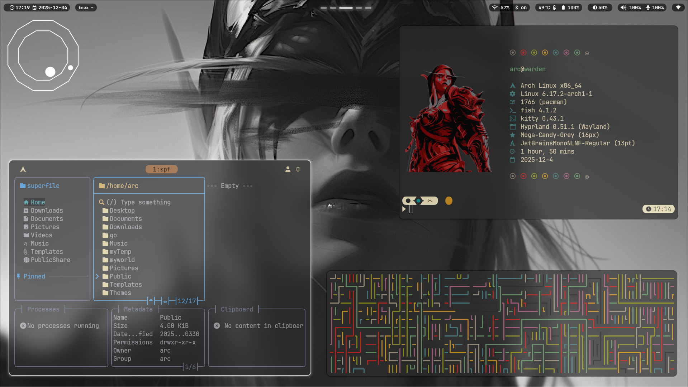
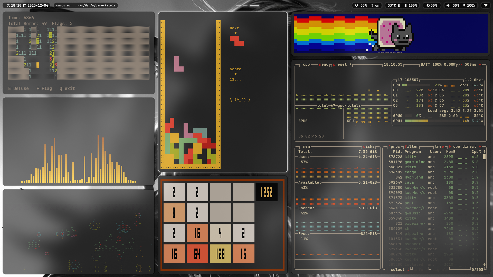
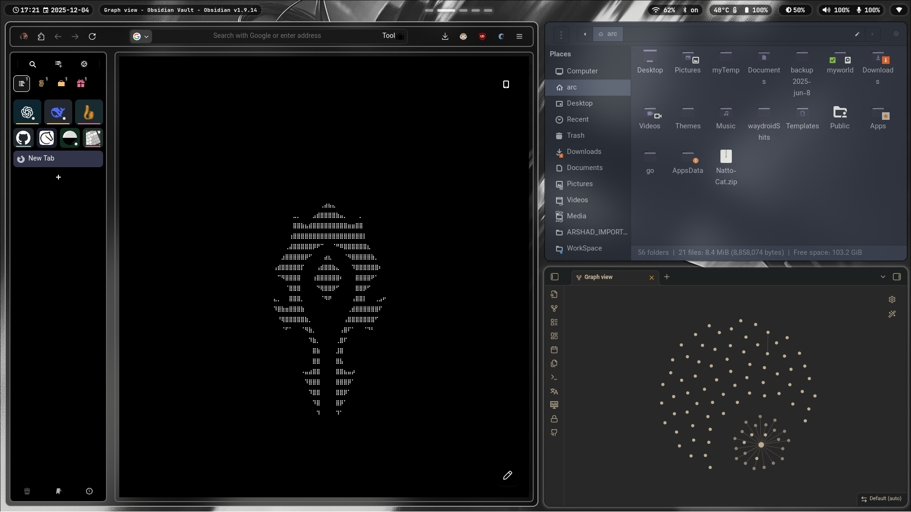
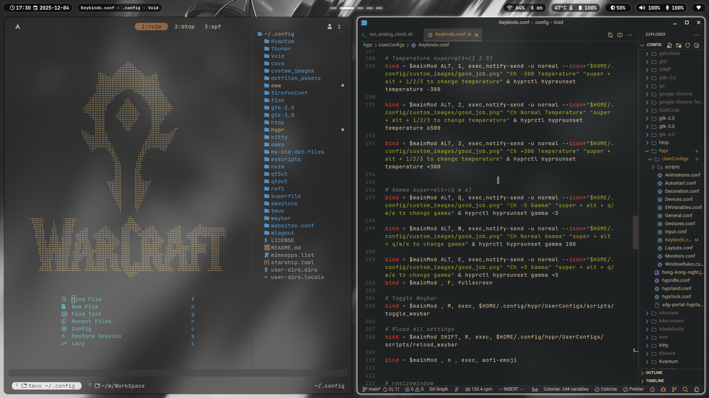
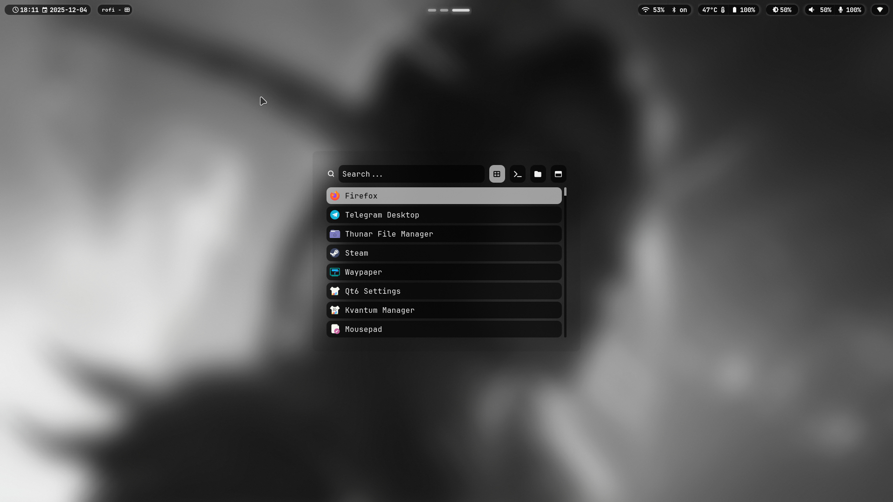
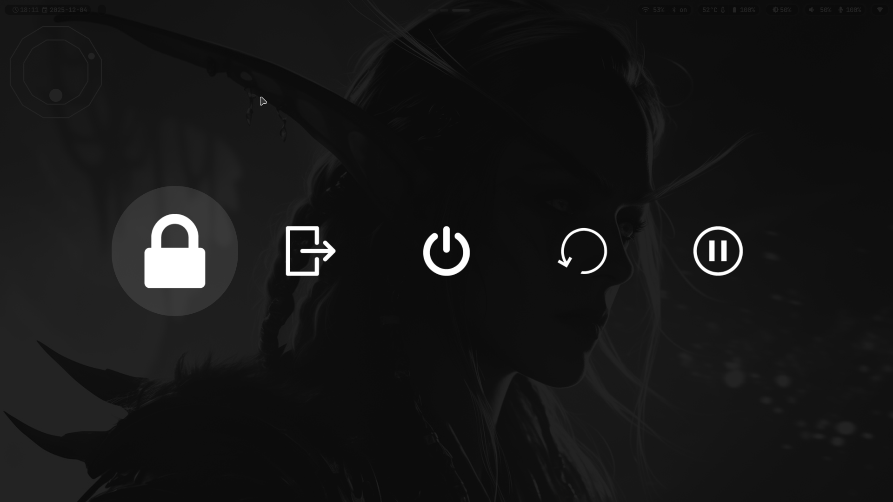
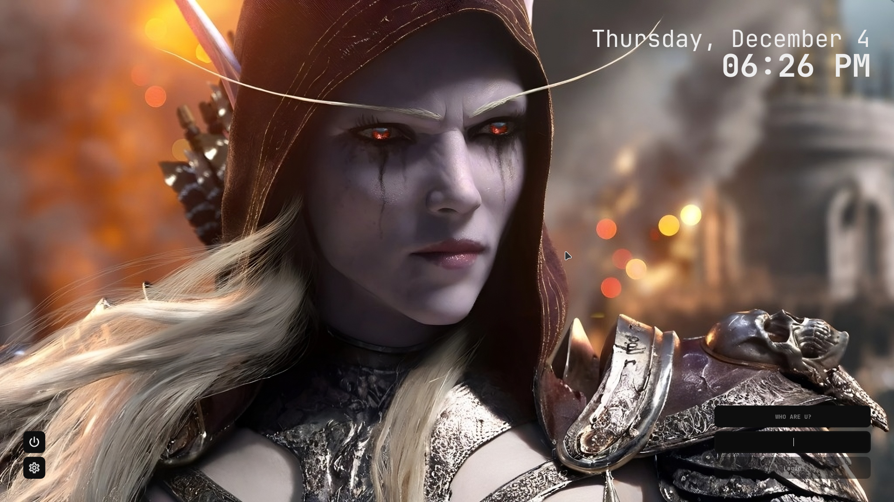
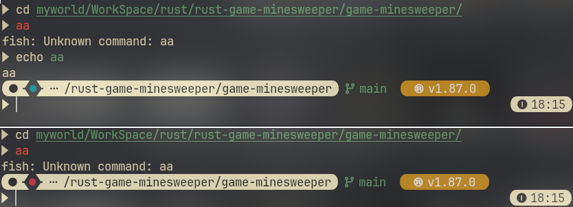

# [My Dotfiles](https://github.com/TohidEq/dotfiles)

**A collection of my personal dotfiles for a highly customized and efficient development environment.**

# 📌 Table of Contents

- [Screenshots](#screenshots)
- [Keybindings](#keybindings)

#

- os: Arch Linux
- wm: Hyprland
- display_manager: SDDM
- notification: mako
- launcher: rofi
- terminal: Kitty
- shell: Fish
- prompt: Starship
- editor:
  - VSCode: gruvbox dark hard, one dark pro night flat
  - neovim: Lazyvim (onedark)
- bar: Waybar
- widgets: Eww
- theme_gtk: Nordic-darker
- icons: Dracula-icons
- cursor: Moga-Candy-Grey
- fonts_ui: Vazirmatn
- fonts_terminal: JetBrainsMonoNL Nerd Font
- grub_theme: BigSur
- Note: Obsidian
- Browser: Firefox (theme: Textfox)
- logout menu: wlogout
- music player: Gapless
- file manager: Thunar
- terminal apps:
  - terminal multiplexer: tmux
  - file manager: superfile
  - audio visualizer: cava
  - process viewers: btop, nvtop
- i don't remember anymore...

> - [My old dotfiles are here](./my-old-dot-files/README.md) (i3 manjaro x11 rofi i3block)

---

# Screenshots

    
    

    
    

    
    
    

## Terminal prompt ‍`inspired by` [voltyea's moonphase.sh](https://github.com/voltyea/nixos/blob/main/dotfiles/matugen/templates/moonphase.sh)

> (current moon phase)+(ok/bad commands results)+(git)+(lang)--(time)

    

---

---

# Keybindings

|          Keybinding           |                             Description                              |              Keybinding              |     Description      |
| :---------------------------: | :------------------------------------------------------------------: | :----------------------------------: | :------------------: |
|              🪟               |                             Window Mgmt                              |       Manage focus and layout        |          🪟          |
|         `SUPER` + `V`         |                            Toggle Pseudo                             |       `SUPER` + `SHIFT` + `Q`        |     Kill Active      |
|  `SUPER` + `SHIFT` + `SPACE`  |                               Floating                               |            `SUPER` + `Q`             |     Toggle Split     |
|         `SUPER` + `F`         |                              Fullscreen                              |    `SUPER` + `H/L/K/J` or Arrows     |        Focus         |
| `SUPER` + `SHIFT` + `H/L/K/J` |                                 Move                                 |      `SUPER` + Mouse Left/Right      |    Move / Resize     |
|         `SUPER` + `R`         |                             Resize Mode                              |     Arrows / HJKL in resize mode     |      Resize Dir      |
|       `ESC` / `Return`        |                             Exit Resize                              |                                      |                      |
|              🖥️               |                              Workspaces                              |      Manage desktops & monitors      |          🖥️          |
|       `SUPER` + `1`-`8`       |                              Switch WS                               |     `SUPER` + `SHIFT` + `1`-`8`      |      Move to WS      |
|  `SUPER` + `CTRL` + `1`-`8`   |                               Mon2 WS                                | `SUPER` + `CTRL` + `SHIFT` + `1`-`8` |   Move to Mon2 WS    |
|        `SUPER` + `Tab`        |                               Prev WS                                |     `SUPER` + `CTRL` + `J` / `L`     |     WS Navigate      |
|              🚀               |                             Applications                             |      Favorite apps & launchers       |          🚀          |
|      `SUPER` + `Return`       |                            Kitty Terminal                            |     `SUPER` + `SHIFT` + `Return`     |      Retro-Term      |
|      `SUPER` + `F1`–`F4`      |                         f1-Obsidian, f2-FFox                         |         f3-Thunar, f4-VSCode         |    Just Runs Apps    |
|   `SUPER` + `SHIFT` + `F4`    |                 ToggleVSCodeTheme (gruvbox/onedark)                  |                                      |                      |
|    `SUPER` + `SHIFT` +`F2`    |                             Tor Browser                              |        `SUPER` + `ALT` + `F2`        |     QuteBrowser      |
|         `SUPER` + `D`         |                               Rofi X11                               |       `SUPER` + `SHIFT` + `D`        |     Rofi Wayland     |
|    `SUPER` + `SHIFT` + `C`    |                             Color Picker                             |       `SUPER` + `SHIFT` + `X`        |     Kill w/Mouse     |
|   `SUPER` + `SHIFT` + `ESC`   |                                 BTop                                 |       `SUPER` + `ALT` + `ESC`        |        NVTop         |
|     `SUPER` + `ALT` + `M`     |                             Music Player                             |        `SUPER` + `ALT` + `N`         |    Next Wallpaper    |
|         `SUPER` + `T`         | Run [TouchServer](https://github.com/SKRInternationals/TouchServer/) |       `SUPER` + `SHIFT` + `T`        |   Kill TouchServer   |
|     `SUPER` + `ALT` + `V`     |                              Run WayVNC                              |       `SUPER` + `SHIFT` + `V`        |     Kill WayVNC      |
|     `SUPER` + `ALT` + `S`     |                            Run SSH-Server                            |       `SUPER` + `SHIFT` + `S`        |   Kill SSH-server    |
|     `SUPER` + `ALT` + `F`     |                            Run FTP-Server                            |        `SUPER` + `ALT` + `S`         |    Run SSH-server    |
|              ⚙️               |                             System Ctrl                              |    Screenshots, Lock, Power, ...     |          ⚙️          |
|         `SUPER` + `9`         |                             Lock Screen                              |            `SUPER` + `0`             |      Power Menu      |
|    `SUPER` + `SHIFT` + `0`    |                             Exit Session                             |            `SUPER` + `S`             |  Screenshot Selecor  |
|    `SUPER` + `SHIFT` + `W`    |                         Toggle EWW (Widgets)                         |           `SUPER` + `F10`            | Screenshot AllScreen |
|   `SUPER` + `ALT` + `1/2/3`   |                            Temp -/Norm/+                             |      `SUPER` + `ALT` + `Q/W/E`       |    Gamma -/Norm/+    |
|   `SUPER` + `ALT` + `8/9/0`   |                         Monitor Dup/Off/Ext                          |       `SUPER` + `SHIFT` + `R`        |    Reload Waybar     |
|         `SUPER` + `M`         |                            Toggle Waybar                             |            `SUPER` + `N`             |     Emoji Picker     |
