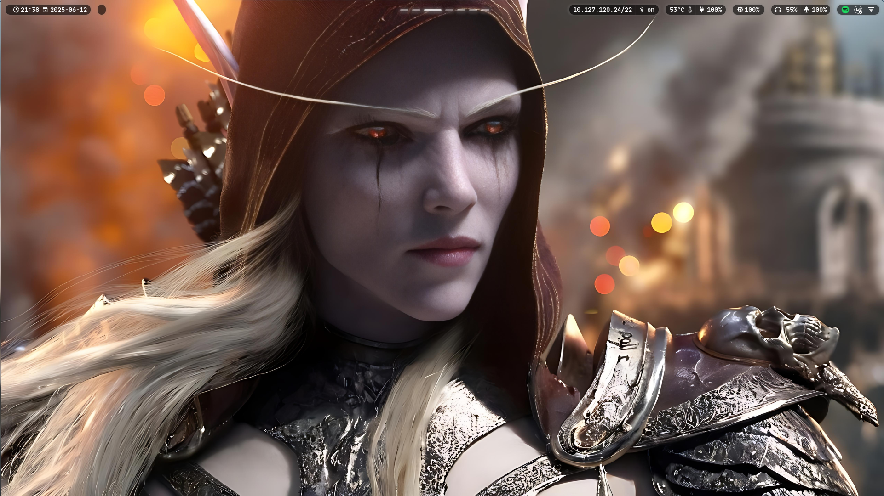
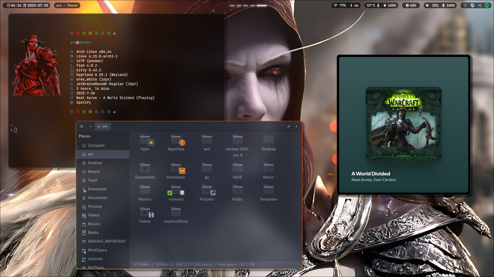
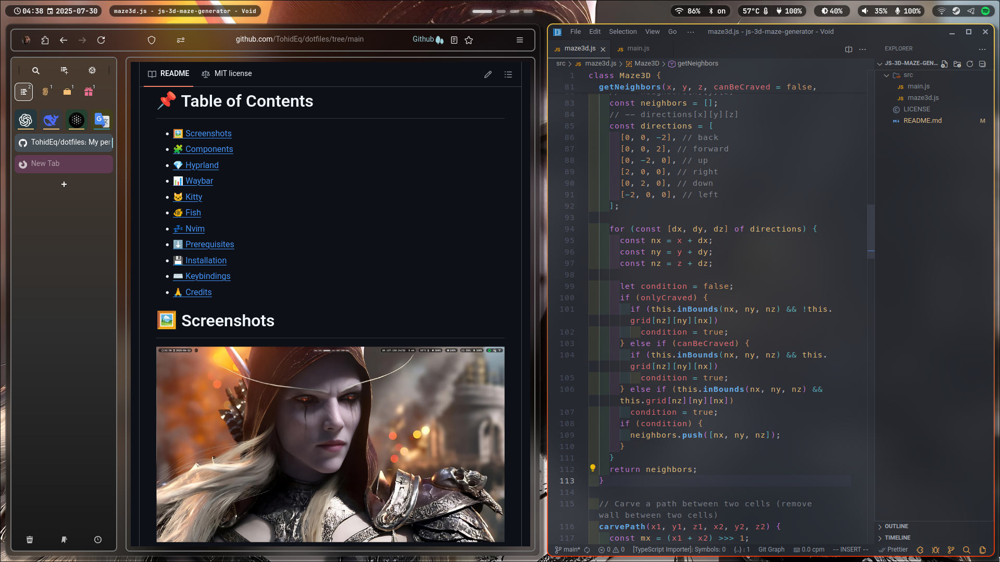
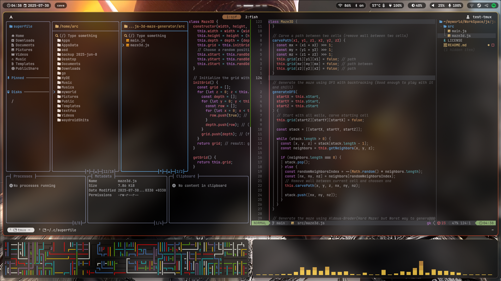

# ✨ My Dotfiles

> A collection of my personal dotfiles for a highly customized and efficient development environment.

This repository contains configuration files for various tools and applications. The main focus is on creating a seamless and productive user experience with a focus on aesthetics and usability

- [My old dotfiles are here](./my-old-dot-files/README.md)(i3 manjaro x11 rofi i3block)

# 📌 Table of Contents

- [🖼️ Screenshots](#screenshots)
- [🧩 Components](#components)
- [💎 Hyprland](#hyprland)
- [📊 Waybar](#waybar)
- [🦊 Firefox](#firefox)
- [🐱 Kitty](#kitty)
- [🐠 Fish](#fish)
- [💤 Nvim](#nvim)
- [⬇️ Prerequisites](#prerequisites)
- [💾 Installation](#installation)
- [⌨️ Keybindings](#keybindings)
- [🙏 Credits](#credits)

<a name="screenshots"/>

# 🖼️ Screenshots



<div style="display: flex; flex-wrap: wrap; justify-content: space-between;">
    
    
</div>

<div style="display: flex; flex-wrap: wrap; justify-content: space-between;">
    
    
</div>

<a name="components"/>

# 🧩 Components

Here's a breakdown of the key components in this dotfiles setup:

- **Hyprland:** A dynamic tiling Wayland compositor that doesn't sacrifice on its looks.
- **Waybar:** A highly customizable Wayland bar.
- **Kitty:** A fast, feature-rich terminal emulator.
- **Fish Shell:** A smart and user-friendly command-line shell.
- **Nvim:** Highly extensible Vim-based text editor

<a name="hyprland"/>

# 💎 Hyprland

Hyprland is the heart of this setup, providing a smooth and visually appealing desktop environment. Configuration is split into several files under `@hypr/UserConfigs/` for better organization.
Some noteworthy configuration files are:

- `@hypr/hyprland.conf`: main Hyprland configuration file.
- `@hypr/UserConfigs/Keybinds.conf`: Keybindings for Hyprland
- `@hypr/UserConfigs/Animations.conf`: Animations used in hyprland.
- `@hypr/UserConfigs/Monitors.conf`: Configures monitors.

Here are some of the most used keybinds you can find in `@hypr/UserConfigs/Keybinds.conf`:

```sh
#Move window with arrow keys
bind = $mainMod SHIFT, left, movewindow, l
bind = $mainMod SHIFT, right, movewindow, r
bind = $mainMod SHIFT, up, movewindow, u
bind = $mainMod SHIFT, down, movewindow, d

#Switch between windows with arrow keys
bind = $mainMod, left, movefocus, l
bind = $mainMod, right, movefocus, r
bind = $mainMod, up, movefocus, u
bind = $mainMod, down, movefocus, d

#Switch to specific workspace
bind = $mainMod, 1, workspace, 1
bind = $mainMod, 2, workspace, 2
bind = $mainMod, 3, workspace, 3
bind = $mainMod, 4, workspace, 4
bind = $mainMod, 5, workspace, 5
bind = $mainMod, 6, workspace, 6
bind = $mainMod, 7, workspace, 7
bind = $mainMod, 8, workspace, 8
```

<a name="waybar"/>

# 📊 Waybar

Waybar provides essential information and controls in a clean and customizable manner.

- `@waybar/config.jsonc`: Defines the modules displayed on the bar, their formatting, and behavior.
- `@waybar/style.css`: Styling for Waybar, including colors, fonts, and spacing.
- `@waybar/scripts/waybar-wttr.py`: script used to display weather information

<a name="firefox"/>

# 🦊 Firefox

To achieve the optimal Firefox setup as seen in this dotfiles repository, follow these steps:

### 📦 Required Extensions / Tools

Install the following manually:

- [**TextFox**](https://github.com/adriankarlen/textfox) – a powerful toolkit for text extraction and manipulation.
- [**Sidebery**](https://github.com/mbnuqw/sidebery) – a sidebar tab manager and session organizer.

---

### 🛠 Applying the Firefox Configuration

1. **Open Firefox and go to:**
   `about:profiles`

2. **Find the path of your active profile** (it's your **Root Directory**).

3. **Back up** the entire contents of that directory before proceeding(**Root Directory**).

4. From this dotfiles repository, locate the folder:

```

firefoxConf/
├── chrome/
└── user.js

```

5. Copy the entire `chrome/` folder **into your Firefox Root Directory**.

6. Also copy `user.js` to the same directory.

7. If prompted to replace files, **accept and overwrite** them.

> 🧠 **Note:** Restart Firefox after applying the configuration to see the changes.

---

This setup provides a customized Firefox experience tailored for better usability, tab management, and visual enhancements.

<a name="kitty"/>

# 🐱 Kitty

Kitty is configured for optimal performance and aesthetics.

- `@kitty/kitty.conf`: Main configuration file, including font settings, colors, and keybindings.
- `@kitty/theme.conf`: Kitty theme configuration.
- `@kitty/kitty-themes/themes/`: Directory containing a variety of themes. You can explore different themes from [kitty-themes](https://github.com/dexpota/kitty-themes)

<a name="fish"/>

# 🐠 Fish

Fish shell enhances the command-line experience with features like autosuggestions, syntax highlighting, and more.

- `@fish/config.fish`: Main configuration file for Fish, including aliases, environment variables, and custom functions.
- `@fish/functions/`: Directory containing custom Fish functions.
- `@fish/fish_plugins`: Contains list of used plugins. Using [Tide](https://github.com/IlanCosman/tide) prompt

<a name="nvim"/>

# 💤 Nvim

Neovim is configured with [LazyVim](https://github.com/LazyVim/LazyVim).

- `@nvim/init.lua`: Loads LazyVim and custom plugins.
- `@nvim/lua/config/`: Directory containing configuration files for LazyVim, keymaps, autocommands, and options.
- `@nvim/lua/plugins/`: Custom plugins for Nvim.

<a name="prerequisites"/>
# ⬇️ Prerequisites

Before installing the dotfiles, ensure that you have the following packages and programs installed on your system. Installation commands are provided for common distributions:

## 📦 Install Required Packages

<details>
<summary><strong>🧪 Arch Linux / Manjaro</strong></summary>

```bash
sudo pacman -S hyprland waybar kitty fish neovim wofi pamixer brightnessctl slurp swappy
```

> For `wlogout`, install via AUR:

```bash
yay -S wlogout
```

</details>

<details>
<summary><strong>🐧 Debian / Ubuntu</strong></summary>

```bash
sudo apt install hyprland waybar kitty fish neovim wofi pamixer brightnessctl slurp swappy wlogout
```

> Make sure your system supports Wayland and has proper repositories for Hyprland.

</details>

<details>
<summary><strong>🎩 Fedora</strong></summary>

```bash
sudo dnf install hyprland waybar kitty fish neovim wofi pamixer brightnessctl slurp swappy wlogout
```

</details>

<a name="installation"/>

# 💾 Installation

**Important: Before proceeding, back up your existing configuration files!** This ensures you can easily revert to your previous settings if needed.

1.  **Backup Your Current Configuration:**

    Before applying these dotfiles, create backups of your existing configurations. This is crucial! Here are some common locations to back up:

    - Hyprland: `~/.config/hypr`
    - Waybar: `~/.config/waybar`
    - Kitty: `~/.config/kitty`
    - Fish: `~/.config/fish`
    - Nvim: `~/.config/nvim`

    Use the following commands to create backups (replace `hypr`, `waybar`, etc. with the appropriate directory names):

    ```bash
    mkdir ~/.config_backup # If you don't already have a backup directory
    cp -r ~/.config/hypr ~/.config_backup/
    cp -r ~/.config/waybar ~/.config_backup/
    cp -r ~/.config/kitty ~/.config_backup/
    cp -r ~/.config/fish ~/.config_backup/
    cp -r ~/.config/nvim ~/.config_backup/
    ```

2.  **Clone the Repository:**

    ```bash
    git clone https://github.com/yourusername/dotfiles.git ~/.dotfiles
    ```

3.  **Identify Your Monitor Names:**

    Hyprland requires you to specify the names of your monitors in the configuration. To find the correct names, run the following command in your terminal:

    ```bash
    hyprctl monitors | grep -E "Monitor|description"
    ```

    This will output information about your connected monitors. Look for the `name` field for each monitor. For example:

    ```
    1) eDP-1 (1920x1080@60.00Hz) at 0x0
    2) HDMI-A-1 (1920x1080@60.00Hz) at 1920x0
    ```

    In this case, the monitor names are `eDP-1` and `HDMI-A-1`. **Write these down, as you'll need them in the next step!**

4.  **Manually Copy Configuration Files:**

    Carefully copy the configuration files from the cloned repository to their respective locations in your home directory. For example:

    - **Hyprland:**

      ```shell
      cp -r ~/.dotfiles/hypr/* ~/.config/hypr/
      ```

      **Important:** Edit the `@hypr/UserConfigs/Monitors.conf` file and replace the example monitor names with the actual names you found in the previous step! This is crucial for your setup to work correctly.

    - **Waybar:**

      ```shell
      cp -r ~/.dotfiles/waybar/* ~/.config/waybar/
      ```

    - **Kitty:**

      ```shell
      cp -r ~/.dotfiles/kitty/* ~/.config/kitty/
      ```

    - **Fish:**

      ```shell
      cp -r ~/.dotfiles/fish/* ~/.config/fish/
      ```

    - **Nvim:**
      ```shell
      cp -r ~/.dotfiles/nvim/* ~/.config/nvim/
      ```

    **Important:** If you encounter files with the same name, carefully review both files and decide whether to replace the existing file, merge the contents, or skip the file.

5.  **Reload/Restart:**

    After copying the files, you'll need to reload or restart the applications for the changes to take effect:

    - **Hyprland:** Restart Hyprland to apply the new configuration.
    - **Waybar:** You can either restart Waybar or send it a reload signal (`pkill -SIGRTMIN+8 waybar`). There's also a reload script located in `@hypr/UserConfigs/scripts/reload_waybar`
    - **Kitty:** Kitty should automatically reload the configuration, but you can restart it if needed.
    - **Fish:** Start a new Fish shell session, or source the config file (`source ~/.config/fish/config.fish`).
    - **Nvim:** Open nvim and run `:source ~/.config/nvim/init.lua`

<a name="keybindings"/>

# ⌨️ Keybindings

Here are some of the key Hyprland keybindings for navigation and window management. To see and edit all the keybinds check `@hypr/UserConfigs/Keybinds.conf`:

<details>
  <summary>
    <b>Short View Of Hotkeys</b>
  </summary>

|          Keybinding           |                             Description                              |              Keybinding              |   Description    |
| :---------------------------: | :------------------------------------------------------------------: | :----------------------------------: | :--------------: |
|              🪟               |                             Window Mgmt                              |       Manage focus and layout        |        🪟        |
|         `SUPER` + `V`         |                            Toggle Pseudo                             |       `SUPER` + `SHIFT` + `Q`        |   Kill Active    |
|  `SUPER` + `SHIFT` + `SPACE`  |                               Floating                               |            `SUPER` + `Q`             |   Toggle Split   |
|         `SUPER` + `F`         |                              Fullscreen                              |    `SUPER` + `H/L/K/J` or Arrows     |      Focus       |
| `SUPER` + `SHIFT` + `H/L/K/J` |                                 Move                                 |      `SUPER` + Mouse Left/Right      |  Move / Resize   |
|         `SUPER` + `R`         |                             Resize Mode                              |     Arrows / HJKL in resize mode     |    Resize Dir    |
|       `ESC` / `Return`        |                             Exit Resize                              |                                      |                  |
|              🖥️               |                              Workspaces                              |      Manage desktops & monitors      |        🖥️        |
|       `SUPER` + `1`-`8`       |                              Switch WS                               |     `SUPER` + `SHIFT` + `1`-`8`      |    Move to WS    |
|  `SUPER` + `CTRL` + `1`-`8`   |                               Mon2 WS                                | `SUPER` + `CTRL` + `SHIFT` + `1`-`8` | Move to Mon2 WS  |
|        `SUPER` + `Tab`        |                               Prev WS                                |     `SUPER` + `CTRL` + `J` / `L`     |   WS Navigate    |
|              🚀               |                             Applications                             |      Favorite apps & launchers       |        🚀        |
|      `SUPER` + `Return`       |                            Kitty Terminal                            |     `SUPER` + `SHIFT` + `Return`     |    Retro-Term    |
|      `SUPER` + `F1`–`F4`      |                         f1-Obsidian, f2-FFox                         |          f3-Thunar, f4-Void          |       Apps       |
|    `SUPER` + `SHIFT` +`F2`    |                              Tor Browser                             |       `SUPER` + `ALT` + `F2`         |    QuteBrowser   |
|         `SUPER` + `D`         |                               Rofi X11                               |       `SUPER` + `SHIFT` + `D`        |   Rofi Wayland   |
|    `SUPER` + `SHIFT` + `C`    |                             Color Picker                             |       `SUPER` + `SHIFT` + `X`        |   Kill w/Mouse   |
|   `SUPER` + `SHIFT` + `ESC`   |                                 BTop                                 |       `SUPER` + `ALT` + `ESC`        |      NVTop       |
|     `SUPER` + `ALT` + `M`     |                             Music Player                             |        `SUPER` + `ALT` + `N`         |  Next Wallpaper  |
|         `SUPER` + `T`         | Run [TouchServer](https://github.com/SKRInternationals/TouchServer/) |       `SUPER` + `SHIFT` + `T`        | Kill TouchServer |
|     `SUPER` + `ALT` + `V`     |                              Run WayVNC                              |       `SUPER` + `SHIFT` + `V`        |   Kill WayVNC    |
|     `SUPER` + `ALT` + `F`     |                              Run FTP-Server                          |       `SUPER` + `ALT` + `S`          |  Run SSH-server  |
|              ⚙️               |                             System Ctrl                              |       Screenshots, Lock, Power       |        ⚙️        |
|         `SUPER` + `9`         |                             Lock Screen                              |            `SUPER` + `0`             |    Power Menu    |
|    `SUPER` + `SHIFT` + `0`    |                             Exit Session                             |            `SUPER` + `S`             |    Screenshot    |
|   `SUPER` + `ALT` + `1/2/3`   |                            Temp -/Norm/+                             |      `SUPER` + `ALT` + `Q/W/E`       |  Gamma -/Norm/+  |
|   `SUPER` + `ALT` + `8/9/0`   |                         Monitor Dup/Off/Ext                          |       `SUPER` + `SHIFT` + `R`        |  Reload Waybar   |
|         `SUPER` + `M`         |                            Toggle Waybar                             |            `SUPER` + `N`             |   Emoji Picker   |

</details>

<details>
  <summary>
    <b>Long View Of Hotkeys</b>
  </summary>

| Category        | Keybinding                              | Description                                                           |
| --------------- | --------------------------------------- | --------------------------------------------------------------------- |
| 🪟 Window Mgmt  | `SUPER` + `V`                           | Toggle pseudo-tiling                                                  |
|                 | `SUPER` + `SHIFT` + `Q`                 | Kill active window                                                    |
|                 | `SUPER` + `SHIFT` + `SPACE`             | Toggle floating window                                                |
|                 | `SUPER` + `Q`                           | Toggle split layout                                                   |
|                 | `SUPER` + `F`                           | Fullscreen active window                                              |
|                 | `SUPER` + `H/L/K/J` or Arrow Keys       | Move focus                                                            |
|                 | `SUPER` + `SHIFT` + `H/L/K/J`           | Move window in direction                                              |
|                 | `SUPER` + Mouse Left / Right            | Move / Resize window                                                  |
| ↔️ Resize Mode  | `SUPER` + `R`                           | Enter resize mode                                                     |
|                 | Arrow keys / HJKL                       | Resize window in resize mode                                          |
|                 | `ESC` or `Return`                       | Exit resize mode                                                      |
| 🖥️ Workspaces   | `SUPER` + `1` to `8`                    | Switch to workspace                                                   |
|                 | `SUPER` + `SHIFT` + `1` to `8`          | Move window to workspace                                              |
|                 | `SUPER` + `CTRL` + `1` to `8`           | Switch to monitor 2 workspace                                         |
|                 | `SUPER` + `CTRL` + `SHIFT` + `1` to `8` | Move window to monitor 2 workspace                                    |
|                 | `SUPER` + `Tab`                         | Go to previous workspace                                              |
|                 | `SUPER` + `CTRL` + `J` / `L`            | Previous / Next workspace                                             |
| 🚀 Applications | `SUPER` + `Return`                      | Launch Kitty terminal                                                 |
|                 | `SUPER` + `SHIFT` + `Return`            | Launch cool-retro-term                                                |
|                 | `SUPER` + `F1` to `F4`                  | Obsidian, Firefox, Thunar, Void                                       |
|                 | `SUPER` + `SHIFT` +`F2`                 | Tor Browser                                                           |
|                 | `SUPER` + `ALT` + `F2`                  | QuteBrowser                                                           |
|                 | `SUPER` + `D` / `SHIFT` + `D`           | Launch Rofi (X11 / Wayland)                                           |
|                 | `SUPER` + `W`                           | Launch archwiki-offline                                               |
|                 | `SUPER` + `SHIFT` + `C`                 | Color picker and copy to clipboard                                    |
|                 | `SUPER` + `SHIFT` + `X`                 | Click to kill window                                                  |
|                 | `SUPER` + `SHIFT` + `ESC`               | Resource Monitoring (BTop)                                            |
|                 | `SUPER` + `ALT` + `ESC`                 | GPU Monitoring (NVTop)                                                |
|                 | `SUPER` + `ALT` + `M`                   | Music Player (Kew)                                                    |
|                 | `SUPER` + `ALT` + `N`                   | Next Random Wallpaper                                                 |
|                 | `SUPER` + `T`                           | Run [TouchServer](https://github.com/SKRInternationals/TouchServer/)  |
|                 | `SUPER` + `SHIFT` + `T`                 | Kill [TouchServer](https://github.com/SKRInternationals/TouchServer/) |
|                 | `SUPER` + `ALT` + `V`                   | Run WayVNC                                                            |
|                 | `SUPER` + `SHIFT` + `V`                 | Kill WayVNC                                                           |
|                 | `SUPER` + `ALT` + `F`                   | Run FileZilla-server (FTP-Server)                                     |
| ⚙️ System Ctrl  | `SUPER` + `S`                           | Screenshot with grim + swappy                                         |
|                 | `SUPER` + `9`                           | Lock screen (swaylock)                                                |
|                 | `SUPER` + `0`                           | Open wlogout                                                          |
|                 | `SUPER` + `SHIFT` + `0`                 | Exit Hyprland session                                                 |
|                 | `SUPER` + `SHIFT` + `R`                 | Reload Waybar config                                                  |
|                 | `SUPER` + `M`                           | Toggle Waybar                                                         |
|                 | `SUPER` + `N`                           | Open Emoji Picker                                                     |
| 🌡️ Hyprsunset   | `SUPER` + `ALT` + `1/2/3`               | Change screen temperature (-300 / normal / +300)                      |
|                 | `SUPER` + `ALT` + `Q/W/E`               | Change gamma (-5 / normal / +5)                                       |
| 🖥️ Monitors     | `SUPER` + `ALT` + `8/9/0`               | Duplicate / Disable / Extend HDMI monitor                             |

</details>

<a name="credits"/>

# 🙏 Credits

- [Hyprland](https://hyprland.org/)
- [Waybar](https://github.com/Alexays/Waybar)
- [Kitty](https://sw.kovidgoyal.net/kitty/)
- [Fish Shell](https://fishshell.com/)
- [LazyVim](https://github.com/LazyVim/LazyVim)
