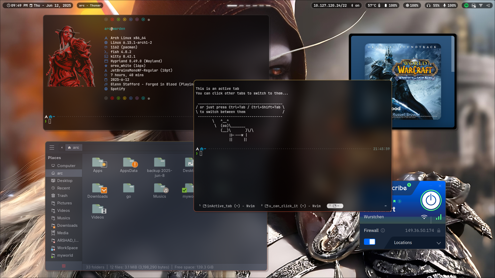
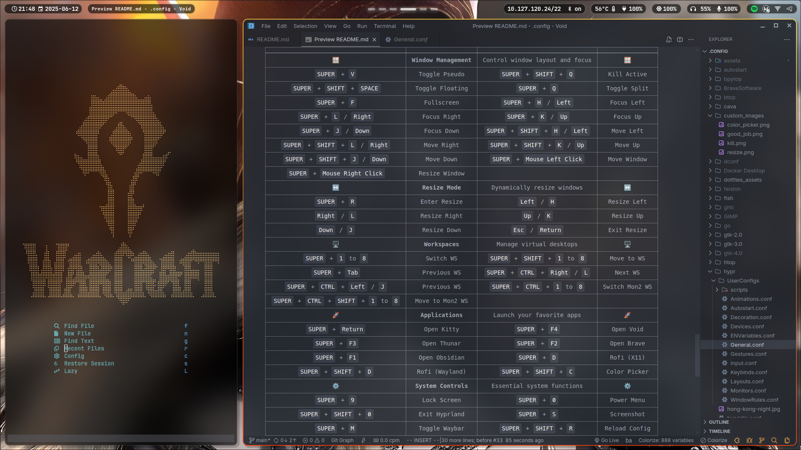
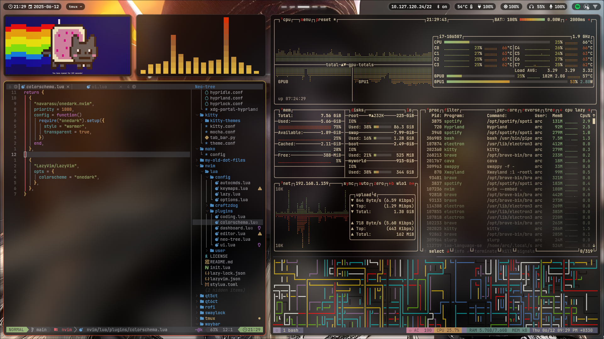

# ✨ My Dotfiles

> A collection of my personal dotfiles for a highly customized and efficient development environment.

This repository contains configuration files for various tools and applications. The main focus is on creating a seamless and productive user experience with a focus on aesthetics and usability

- [My old dotfiles are here](./my-old-dot-files/README.md)(i3 manjaro x11 rofi i3block)

# 📌 Table of Contents

- [🖼️ Screenshots](##screenshots)
- [🧩 Components](#components)
- [💎 Hyprland](#hyprland)
- [📊 Waybar](#waybar)
- [🐱 Kitty](#kitty)
- [🐠 Fish](#fish)
- [💤 Nvim](#nvim)
- [⬇️ Prerequisites](#prerequisites)
- [💾 Installation](#installation)
- [⌨️ Keybindings](#keybindings)
- [🙏 Credits](#credits)

# 🖼️ Screenshots

Add your own screenshots here to showcase your setup!


<div style="display: flex; flex-wrap: wrap; justify-content: space-between;">
    
    
</div>

<div style="display: flex; flex-wrap: wrap; justify-content: space-between;">
    
    
</div>
# 🧩 Components

Here's a breakdown of the key components in this dotfiles setup:

- **Hyprland:** A dynamic tiling Wayland compositor that doesn't sacrifice on its looks.
- **Waybar:** A highly customizable Wayland bar.
- **Kitty:** A fast, feature-rich terminal emulator.
- **Fish Shell:** A smart and user-friendly command-line shell.
- **Nvim:** Highly extensible Vim-based text editor

# 💎 Hyprland

Hyprland is the heart of this setup, providing a smooth and visually appealing desktop environment. Configuration is split into several files under `@hypr/UserConfigs/` for better organization.
Some noteworthy configuration files are:

- `@hypr/hyprland.conf`: main Hyprland configuration file.
- `@hypr/UserConfigs/Keybinds.conf`: Keybindings for Hyprland
- `@hypr/UserConfigs/Animations.conf`: Animations used in hyprland.
- `@hypr/UserConfigs/Monitors.conf`: Configures monitors.

Here are some of the most used keybinds you can find in `@hypr/UserConfigs/Keybinds.conf`:

```sh
#Move window with arrow keys
bind = $mainMod SHIFT, left, movewindow, l
bind = $mainMod SHIFT, right, movewindow, r
bind = $mainMod SHIFT, up, movewindow, u
bind = $mainMod SHIFT, down, movewindow, d

#Switch between windows with arrow keys
bind = $mainMod, left, movefocus, l
bind = $mainMod, right, movefocus, r
bind = $mainMod, up, movefocus, u
bind = $mainMod, down, movefocus, d

#Switch to specific workspace
bind = $mainMod, 1, workspace, 1
bind = $mainMod, 2, workspace, 2
bind = $mainMod, 3, workspace, 3
bind = $mainMod, 4, workspace, 4
bind = $mainMod, 5, workspace, 5
bind = $mainMod, 6, workspace, 6
bind = $mainMod, 7, workspace, 7
bind = $mainMod, 8, workspace, 8
```

# 📊 Waybar

Waybar provides essential information and controls in a clean and customizable manner.

- `@waybar/config.jsonc`: Defines the modules displayed on the bar, their formatting, and behavior.
- `@waybar/style.css`: Styling for Waybar, including colors, fonts, and spacing.
- `@waybar/scripts/waybar-wttr.py`: script used to display weather information

# 🐱 Kitty

Kitty is configured for optimal performance and aesthetics.

- `@kitty/kitty.conf`: Main configuration file, including font settings, colors, and keybindings.
- `@kitty/theme.conf`: Kitty theme configuration.
- `@kitty/kitty-themes/themes/`: Directory containing a variety of themes. You can explore different themes from [kitty-themes](https://github.com/dexpota/kitty-themes)

# 🐠 Fish

Fish shell enhances the command-line experience with features like autosuggestions, syntax highlighting, and more.

- `@fish/config.fish`: Main configuration file for Fish, including aliases, environment variables, and custom functions.
- `@fish/functions/`: Directory containing custom Fish functions.
- `@fish/fish_plugins`: Contains list of used plugins. Using [Tide](https://github.com/IlanCosman/tide) prompt

# 💤 Nvim

Neovim is configured with [LazyVim](https://github.com/LazyVim/LazyVim).

- `@nvim/init.lua`: Loads LazyVim and custom plugins.
- `@nvim/lua/config/`: Directory containing configuration files for LazyVim, keymaps, autocommands, and options.
- `@nvim/lua/plugins/`: Custom plugins for Nvim.

# ⬇️ Prerequisites

Before installing the dotfiles, ensure that you have the following packages and programs installed on your system. Installation commands are provided for common distributions:

## 📦 Install Required Packages

<details>
<summary><strong>🧪 Arch Linux / Manjaro</strong></summary>

```bash
sudo pacman -S hyprland waybar kitty fish neovim wofi pamixer brightnessctl slurp swappy
```

> For `wlogout`, install via AUR:

```bash
yay -S wlogout
```

</details>

<details>
<summary><strong>🐧 Debian / Ubuntu</strong></summary>

```bash
sudo apt install hyprland waybar kitty fish neovim wofi pamixer brightnessctl slurp swappy wlogout
```

> Make sure your system supports Wayland and has proper repositories for Hyprland.

</details>

<details>
<summary><strong>🎩 Fedora</strong></summary>

```bash
sudo dnf install hyprland waybar kitty fish neovim wofi pamixer brightnessctl slurp swappy wlogout
```

</details>

# 💾 Installation

**Important: Before proceeding, back up your existing configuration files!** This ensures you can easily revert to your previous settings if needed.

1.  **Backup Your Current Configuration:**

    Before applying these dotfiles, create backups of your existing configurations. This is crucial! Here are some common locations to back up:

    - Hyprland: `~/.config/hypr`
    - Waybar: `~/.config/waybar`
    - Kitty: `~/.config/kitty`
    - Fish: `~/.config/fish`
    - Nvim: `~/.config/nvim`

    Use the following commands to create backups (replace `hypr`, `waybar`, etc. with the appropriate directory names):

    ```bash
    mkdir ~/.config_backup # If you don't already have a backup directory
    cp -r ~/.config/hypr ~/.config_backup/
    cp -r ~/.config/waybar ~/.config_backup/
    cp -r ~/.config/kitty ~/.config_backup/
    cp -r ~/.config/fish ~/.config_backup/
    cp -r ~/.config/nvim ~/.config_backup/
    ```

2.  **Clone the Repository:**

    ```bash
    git clone https://github.com/yourusername/dotfiles.git ~/.dotfiles
    ```

3.  **Identify Your Monitor Names:**

    Hyprland requires you to specify the names of your monitors in the configuration. To find the correct names, run the following command in your terminal:

    ```bash
    hyprctl monitors | grep -E "Monitor|description"
    ```

    This will output information about your connected monitors. Look for the `name` field for each monitor. For example:

    ```
    1) eDP-1 (1920x1080@60.00Hz) at 0x0
    2) HDMI-A-1 (1920x1080@60.00Hz) at 1920x0
    ```

    In this case, the monitor names are `eDP-1` and `HDMI-A-1`. **Write these down, as you'll need them in the next step!**

4.  **Manually Copy Configuration Files:**

    Carefully copy the configuration files from the cloned repository to their respective locations in your home directory. For example:

    - **Hyprland:**

      ```shell
      cp -r ~/.dotfiles/hypr/* ~/.config/hypr/
      ```

      **Important:** Edit the `@hypr/UserConfigs/Monitors.conf` file and replace the example monitor names with the actual names you found in the previous step! This is crucial for your setup to work correctly.

    - **Waybar:**

      ```shell
      cp -r ~/.dotfiles/waybar/* ~/.config/waybar/
      ```

    - **Kitty:**

      ```shell
      cp -r ~/.dotfiles/kitty/* ~/.config/kitty/
      ```

    - **Fish:**

      ```shell
      cp -r ~/.dotfiles/fish/* ~/.config/fish/
      ```

    - **Nvim:**
      ```shell
      cp -r ~/.dotfiles/nvim/* ~/.config/nvim/
      ```

    **Important:** If you encounter files with the same name, carefully review both files and decide whether to replace the existing file, merge the contents, or skip the file.

5.  **Reload/Restart:**

    After copying the files, you'll need to reload or restart the applications for the changes to take effect:

    - **Hyprland:** Restart Hyprland to apply the new configuration.
    - **Waybar:** You can either restart Waybar or send it a reload signal (`pkill -SIGRTMIN+8 waybar`). There's also a reload script located in `@hypr/UserConfigs/scripts/reload_waybar`
    - **Kitty:** Kitty should automatically reload the configuration, but you can restart it if needed.
    - **Fish:** Start a new Fish shell session, or source the config file (`source ~/.config/fish/config.fish`).
    - **Nvim:** Open nvim and run `:source ~/.config/nvim/init.lua`

# ⌨️ Keybindings

Here are some of the key Hyprland keybindings for navigation and window management. To see and edit all the keybinds check `@hypr/UserConfigs/Keybinds.conf`:

<details>
  <summary>
  <b>Short  View Of Hotkeys</b>
  </summary>

|                                         |                       |                                  |                |
| :-------------------------------------: | :-------------------: | :------------------------------: | :------------: |
|                   🪟                    | **Window Management** | Control window layout and focus  |       🪟       |
|              `SUPER` + `V`              |     Toggle Pseudo     |     `SUPER` + `SHIFT` + `Q`      |  Kill Active   |
|       `SUPER` + `SHIFT` + `SPACE`       |    Toggle Floating    |          `SUPER` + `Q`           |  Toggle Split  |
|              `SUPER` + `F`              |      Fullscreen       |      `SUPER` + `H` / `Left`      |   Focus Left   |
|         `SUPER` + `L` / `Right`         |      Focus Right      |       `SUPER` + `K` / `Up`       |    Focus Up    |
|         `SUPER` + `J` / `Down`          |      Focus Down       | `SUPER` + `SHIFT` + `H` / `Left` |   Move Left    |
|    `SUPER` + `SHIFT` + `L` / `Right`    |      Move Right       |  `SUPER` + `SHIFT` + `K` / `Up`  |    Move Up     |
|    `SUPER` + `SHIFT` + `J` / `Down`     |       Move Down       |   `SUPER` + `Mouse Left Click`   |  Move Window   |
|      `SUPER` + `Mouse Right Click`      |     Resize Window     |                                  |                |
|                   ↔️                    |    **Resize Mode**    |    Dynamically resize windows    |       ↔️       |
|              `SUPER` + `R`              |     Enter Resize      |           `Left` / `H`           |  Resize Left   |
|              `Right` / `L`              |     Resize Right      |            `Up` / `K`            |   Resize Up    |
|              `Down` / `J`               |      Resize Down      |         `Esc` / `Return`         |  Exit Resize   |
|                   🖥️                    |    **Workspaces**     |     Manage virtual desktops      |       🖥️       |
|          `SUPER` + `1` to `8`           |       Switch WS       |  `SUPER` + `SHIFT` + `1` to `8`  |   Move to WS   |
|             `SUPER` + `Tab`             |      Previous WS      | `SUPER` + `CTRL` + `Right` / `L` |    Next WS     |
|     `SUPER` + `CTRL` + `Left` / `J`     |      Previous WS      |  `SUPER` + `CTRL` + `1` to `8`   | Switch Mon2 WS |
| `SUPER` + `CTRL` + `SHIFT` + `1` to `8` |    Move to Mon2 WS    |                                  |                |
|                   🚀                    |   **Applications**    |    Launch your favorite apps     |       🚀       |
|           `SUPER` + `Return`            |      Open Kitty       |          `SUPER` + `F4`          |   Open Void    |
|             `SUPER` + `F3`              |      Open Thunar      |          `SUPER` + `F2`          |   Open Brave   |
|             `SUPER` + `F1`              |     Open Obsidian     |          `SUPER` + `D`           |   Rofi (X11)   |
|         `SUPER` + `SHIFT` + `D`         |    Rofi (Wayland)     |     `SUPER` + `SHIFT` + `C`      |  Color Picker  |
|                   ⚙️                    |  **System Controls**  |    Essential system functions    |       ⚙️       |
|              `SUPER` + `9`              |      Lock Screen      |          `SUPER` + `0`           |   Power Menu   |
|         `SUPER` + `SHIFT` + `0`         |     Exit Hyprland     |          `SUPER` + `S`           |   Screenshot   |
|              `SUPER` + `M`              |     Toggle Waybar     |     `SUPER` + `SHIFT` + `R`      | Reload Config  |

</details>

<details>
  <summary>
  <b>Long View Of Hotkeys</b>
  </summary>

| Category                       |               Keybinding                | Description                                       |
| ------------------------------ | :-------------------------------------: | ------------------------------------------------- |
| 🪟                             |          **Window Management**          | 🪟                                                |
| Pseudo (Dwindle)               |              `SUPER` + `V`              | Toggles pseudo-tiling for active window.          |
| Close Active Window            |         `SUPER` + `SHIFT` + `Q`         | Kills the focused window.                         |
| Toggle Floating                |       `SUPER` + `SHIFT` + `SPACE`       | Toggles window's floating state.                  |
| Toggle Split Layout            |              `SUPER` + `Q`              | Changes split direction for new windows.          |
| Fullscreen                     |              `SUPER` + `F`              | Makes active window fullscreen.                   |
| Focus Left                     |         `SUPER` + `H` / `Left`          | Moves focus to window on the left.                |
| Focus Right                    |         `SUPER` + `L` / `Right`         | Moves focus to window on the right.               |
| Focus Up                       |          `SUPER` + `K` / `Up`           | Moves focus to window above.                      |
| Focus Down                     |         `SUPER` + `J` / `Down`          | Moves focus to window below.                      |
| Move Window Left               |    `SUPER` + `SHIFT` + `H` / `Left`     | Moves active window left.                         |
| Move Window Right              |    `SUPER` + `SHIFT` + `L` / `Right`    | Moves active window right.                        |
| Move Window Up                 |     `SUPER` + `SHIFT` + `K` / `Up`      | Moves active window up.                           |
| Move Window Down               |    `SUPER` + `SHIFT` + `J` / `Down`     | Moves active window down.                         |
| Move Window (Mouse)            |      `SUPER` + `Mouse Left Click`       | Drag to move active window.                       |
| Resize Window (Mouse)          |      `SUPER` + `Mouse Right Click`      | Drag to resize active window.                     |
| ↔️                             |             **Resize Mode**             | ↔️                                                |
| Resize Left                    |      `Left` / `H` (in resize mode)      |                                                   |
| Resize Right                   |     `Right` / `L` (in resize mode)      |                                                   |
| Resize Up                      |       `Up` / `K` (in resize mode)       |                                                   |
| Resize Down                    |      `Down` / `J` (in resize mode)      |                                                   |
| Exit Resize Mode               |    `Esc` / `Return` (in resize mode)    |                                                   |
| 🖥️                             |             **Workspaces**              | 🖥️                                                |
| Switch to WS 1-8               |          `SUPER` + `1` to `8`           | Switches to specified workspace.                  |
| Move Window to WS 1-8          |     `SUPER` + `SHIFT` + `1` to `8`      | Moves active window to specified workspace.       |
| Switch to Previous WS          |             `SUPER` + `Tab`             | Switches to previous workspace.                   |
| Switch to Next WS              |    `SUPER` + `CTRL` + `Right` / `L`     | Switches to next workspace.                       |
| Switch to Previous WS          |     `SUPER` + `CTRL` + `Left` / `J`     | Switches to previous workspace.                   |
| Switch to WS 9-16 (Mon 2)      |      `SUPER` + `CTRL` + `1` to `8`      | Switches to second monitor workspaces.            |
| Move Window to WS 9-16 (Mon 2) | `SUPER` + `CTRL` + `SHIFT` + `1` to `8` | Moves active window to second monitor workspaces. |
| 🚀                             |            **Applications**             | 🚀                                                |
| Terminal (Kitty)               |           `SUPER` + `Return`            | Launches Kitty terminal.                          |
| Void                           |             `SUPER` + `F4`              | Launches 'void' application.                      |
| Thunar                         |             `SUPER` + `F3`              | Launches Thunar file manager.                     |
| Brave Browser                  |             `SUPER` + `F2`              | Launches Brave browser.                           |
| Obsidian                       |             `SUPER` + `F1`              | Launches Obsidian.                                |
| Rofi Launcher (X11)            |              `SUPER` + `D`              | Launches Rofi (X11 config).                       |
| Rofi Launcher (Wayland)        |         `SUPER` + `SHIFT` + `D`         | Launches Rofi (Wayland config).                   |
| Color Picker                   |         `SUPER` + `SHIFT` + `C`         | Picks color & copies to clipboard.                |
| ⚙️                             |           **System Controls**           | ⚙️                                                |
| Lock Screen                    |              `SUPER` + `9`              | Locks screen with `swaylock`.                     |
| Power/Logout Menu              |              `SUPER` + `0`              | Launches `wlogout` menu.                          |
| Exit Hyprland                  |         `SUPER` + `SHIFT` + `0`         | Exits Hyprland session.                           |
| Take Screenshot                |              `SUPER` + `S`              | Takes screenshot of selected area.                |
| Toggle Waybar                  |              `SUPER` + `M`              | Toggles Waybar visibility.                        |
| Reload Waybar/Settings         |         `SUPER` + `SHIFT` + `R`         | Reloads Waybar config.                            |

</details>

# 🙏 Credits

- [Hyprland](https://hyprland.org/)
- [Waybar](https://github.com/Alexays/Waybar)
- [Kitty](https://sw.kovidgoyal.net/kitty/)
- [Fish Shell](https://fishshell.com/)
- [LazyVim](https://github.com/LazyVim/LazyVim)
